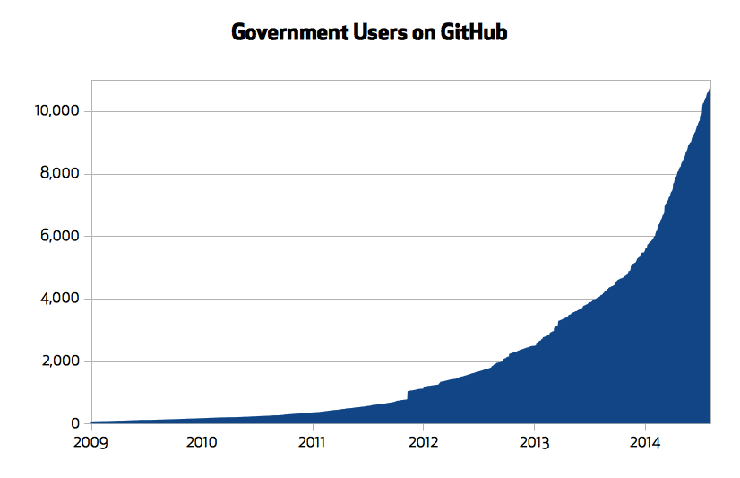
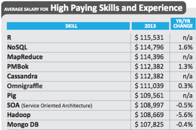
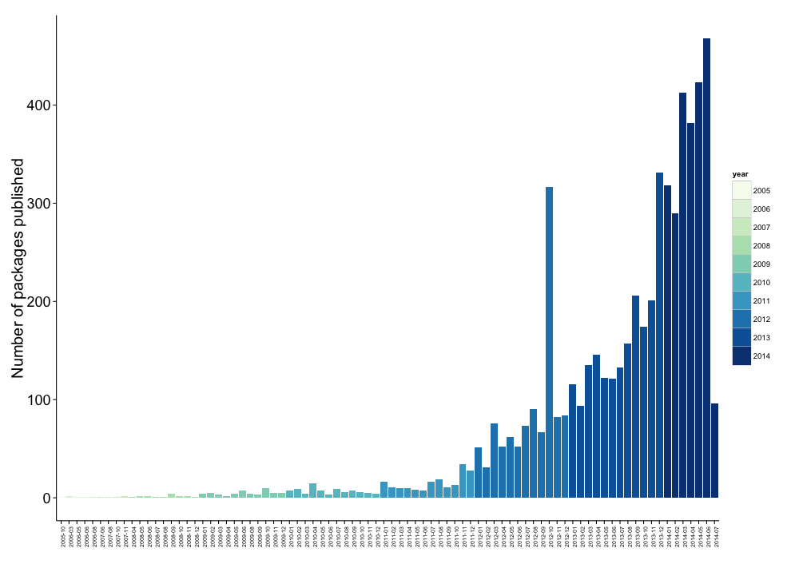
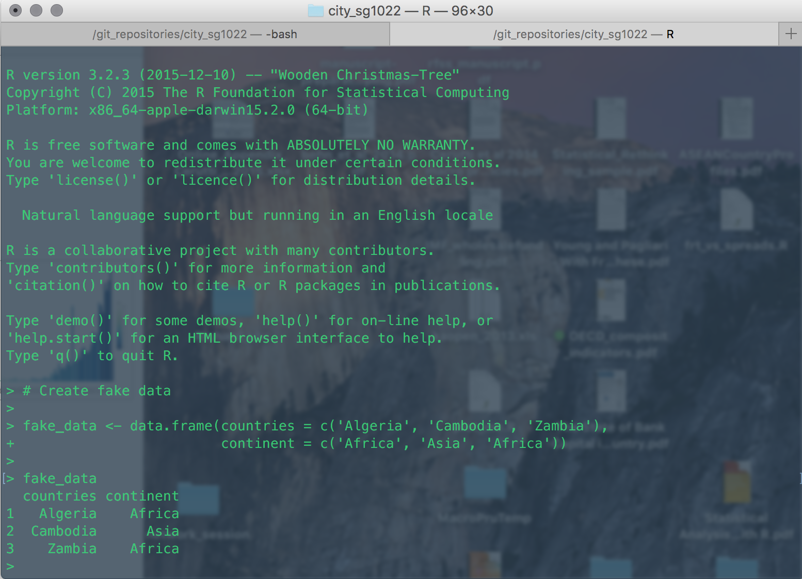
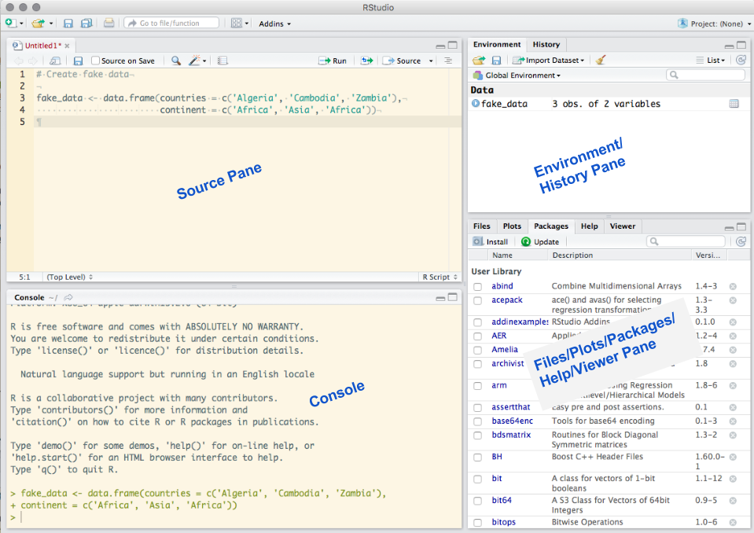

## <i class="fa fa-arrow-circle-o-up"></i> Objectives

- Motivation

- Getting around R and RStudio

- Basics of object-oriented programming in R

- Finding Help and Installing Packages

## <i class="fa fa-compass"></i> Motivation: Government

Government agencies are increasingly adopting the technologies and methods
of open data science.

[](https://github.com/blog/1874-government-opens-up-10k-active-government-users-on-github)

## <i class="fa fa-compass"></i> Motivation: Government

- Public data is increasingly **accessible**.

    + e.g. [World Bank Development Indicators](http://data.worldbank.org/data-catalog/world-development-indicators),
    [GovData Germany](https://www.govdata.de/neues), [data.gov.uk](http://data.gov.uk/),
    [New York City](https://nycopendata.socrata.com/),
    [data.gov](https://www.data.gov/open-gov/)

- Governments rely on data analysis for evidence based decision-making.

    + Tools of open data analysis enable better use of data **within** and
    **between** government actors.

    + Governments can take advantage of analyses done by **third parties**.

## <i class="fa fa-compass"></i> Motivation: Government

- They are also **sharing** and **collaboratively** developing code; **reducing
development costs** and **improving applications**.

- Version control to **increase engagement with the legislative process**.

    + San Francisco laws are now [<i class="fa fa-code-fork"></i>](https://help.github.com/articles/fork-a-repo)
    [forkable](https://github.com/SFMOCI/openlaw).

## <i class="fa fa-compass"></i> Motivation: NGO

NGO's are becoming increasingly data-oriented and need people with **skills** to
**handle and analyse** this data.

Ex. One of my former students recently co-founded
[CorrelAid](http://correlaid.org/) to assist NGOs with data analysis.

## <i class="fa fa-compass"></i> Motivation: Business

Data analysis and R programming skills in particular are **highly valued** in
businesses such as finance and management.



Source: [Revolution Analytics (2014)](http://blog.revolutionanalytics.com/2014/02/r-salary-surveys.html)

## <i class="fa fa-question-circle"></i> What is R?

**Open source programming language**, with a particular focus on statistical programming.

**History:** Originally (in 1993) an implementation of the S programming language (Bell Labs), by
**R**oss Ihaka and **R**obert Gentleman (hence **R**) at University of Auckland.

Currently the R Foundation for Statistical Computing is based in Vienna.
Development is distributed globally.


## {.flexbox .vcenter}


SPSS is a **computer program** that can do statistics.

R is a **programming language** with strong statistical capabilities.

## Implications

- Learning R means **learning computer programming** (applied statistics is programming!)

- R is much, **much more flexible** than SPSS. For example, can do text analysis, SPSS can't.

- Price:

    + R is open source = **FREE**.

    + SPSS **> £1,000**.

- R and statistical programming languages are increasingly wanted in **high demand data science jobs**.

## <i class="fa fa-line-chart"></i> Comparative Google Search Interest

```{r echo=FALSE, message=FALSE, warning=FALSE}
library(rio)
library(tidyr)
library(lubridate)
library(ggplot2)

searches <- import('data/google_trends_results.csv')
searches$Week <- ymd(searches$Week)

searches <- gather(searches, Program, interest, 2:5)

ggplot(searches, aes(Week, interest, group = Program, colour = Program)) +
    geom_line(alpha = 0.3) +
    geom_smooth(se = F) +
    xlab('') + ylab('Interest\n') +
    theme_bw()

```

Source: <https://www.google.com/trends>

## <i class="fa fa-line-chart"></i> Growing popularity

R can be easily expanded by **user-created packages**  hosted on GitHub and/or
[CRAN](http://cran.r-project.org/).

[](http://www.r-bloggers.com/analyzing-package-dependencies-and-download-logs-from-rstudio-and-a-start-towards-building-an-r-recommendation-engine/)


## {.flexbox .vcenter}


RStudio is an Integrated Developer Environment (IDE) that makes using R
and other reproducible research tools easier.

## R Console {.flexbox .vcenter}

 

## RStudio {.flexbox .vcenter}

 

## More RStudio Resources {.flexbox .vcenter}

For a detailed tour: <http://dss.princeton.edu/training/RStudio101.pdf>


## {.flexbox .vcenter}

R is a programming language. So, you will have to **change how you think about data/interacting with the computer**.


## Fundamentals of the R language

Like many other popular programming languages, R is **object-oriented**.

**Objects are R's nouns**. They include (not exhaustive):

- character strings (e.g. words)

- numbers

- vectors of numbers or character strings

- matrices

- data frames

- lists

## R is a Calculator

```{r}
2 + 3

2 - 3

2 * 3

2 / 3
```

## Assignment

You use the **assignment operator** (`<-`) to assign character strings,
numbers, vectors, etc. to object names

```{r}
## Assign the number 10 to an object called number
number <- 10

number
```

```{r}
# Assign Hello World to an object called words
words <- "Hello World"

words
```

## Assignment

You can assign almost anything to an object. For example, the output of a maths operation:

```{r}
divided <- 2 / 3

divided
```

## Assignment

You can also use the equality sign (`=`):

```{r}
number = 10

number
```

Note: it has a slightly different meaning.

See [StackOverflow](http://stackoverflow.com/questions/1741820/assignment-operators-in-r-and)
discussion.

## Special values in R

- `NA`: not available, missing

- `NULL`: does not exist, is undefined

- `TRUE`, `T`: logical true. **Logical** is also an object class.

- `FALSE`, `F`: logical false

## Finding special values

| Function  | Meaning              |
| --------- | -------------------- |
| `is.na`   | Is the value `NA`    |
| `is.null` | Is the value `NULL`  |
| `isTRUE`  | Is the value `TRUE`  |
| `!isTRUE` | Is the value `FALSE` |

<br>

```{r}
absent <- NA
is.na(absent)
```

---

| Operator | Meaning                  |
| -------- | ------------------------ |
| `<`      | less than                |
| `>`      | greater than             |
| `==`     | equal to                 |
| `<=`     | less than or equal to    |
| `>=`     | greater than or equal to |
| `!=`     | not equal to             |
| `a | b`  | a or b                   |
| `a & b`  | a and b                  |

## Classes

Objects have distinct classes.

```{r}
# Find the class of number
class(number)

# Find the class of absent
class(absent)
```

## Naming objects

- Object names **cannot have spaces**

    + Use `CamelCase`, `name_underscore`, or `name.period`

- Avoid creating an object with the same name as a function (e.g. `c` and `t`) or
special value (`NA`, `NULL`, `TRUE`, `FALSE`).

- Use **descriptive object names**!

    + Not: `obj1`, `obj2`

- Each object name must be **unique** in an environment.

    + <i class="fa fa-exclamation"></i> Assigning something to an object name that is already in use will **overwrite
    the object's previous contents**.

## Finding objects

```{r}
# Find objects in your workspace
ls()
```

Or the *Environment* tab in RStudio

## Style Guides

As with natural language writing, it is a good idea to stick to one style guide
with your R code:

- [Google's R Style Guide](https://google-styleguide.googlecode.com/svn/trunk/Rguide.xml)

- [Hadely Wickham's R Style Guide](http://r-pkgs.had.co.nz/style.html)

## Vectors

A vector is an **ordered collection** of numbers, characters, etc. of the
**same type**.

Vectors can be created with the `c` (**combine**) function.

```{r}
# Create numeric vector
numeric_vector <- c(1, 2, 3)

# Create character vector
character_vector <- c('Albania', 'Botswana', 'Cambodia')
```

## Factor class vector

Categorical variables are called **factors** in R.

```{r}
# Create numeric vector
fruits <- c(1, 1, 2)

# Create character vector for factor labels
fruit_names <- c('apples', 'mangos')

# Convert to labelled factor
fruits_factor <- factor(fruits, labels = fruit_names)

summary(fruits_factor)
```

## Matrices

Matrices are collections of vectors **with the same length and class**.

```{r}
# Combine numeric_vector and character_vector into a matrix
combined <- cbind(numeric_vector, character_vector)

combined
```

Note (1): R *coerced* `numeric_vector` into a character vector.

Note (2): You can `rbind` new rows onto a matrix.

## Data frames

Data frames are collections of vectors with the same length.

Each column (vector) can be of a **different class**.

```{r}
# Combine numeric_vector and character_vector into a data frame
combined_df <- data.frame(numeric_vector, character_vector,
                          stringsAsFactors = FALSE)

combined_df
```

## Lists

A list is an object containing other objects that can have **different** lengths and classes.

```{r}
# Create a list with three objects of different lengths
test_list <- list(countries = character_vector, not_there = c(NA, NA),
                  more_numbers = 1:10)
test_list
```

## Functions

Functions do things to/with objects. Functions are like **R's verbs**.

When using functions to do things to objects, they are always followed by
parentheses `()`. The parentheses contain the **arguments**. Arguments are
separated by commas.

```{r}
# Summarise combined_df
summary(combined_df, digits = 2)
```

## Functions help

Use `?` to find out what arguments a function can take.

```{r, eval=FALSE}
?summary
```

The help page will also show the function's **default argument values**.

## Component selection (`$`)

The `$` is known as the component selector. It selects a component of an object.

```{r}
combined_df$character_vector
```

## Subscripts `[]`

You can use subscripts `[]` to also select components.

For data frames they have a `[row, column]` pattern.

```{r}
# Select the second row and first column of combined_df
combined_df[2, 1]


# Select the first two rows
combined_df[c(1, 2), ]
```

## Subscripts `[]`

```{r}
# Select the character_vector column
combined_df[, 'character_vector']
```

## Assigment with elements of objects

You can use assignment with parts of objects. For example:

```{r}
combined_df$character_vector[3] <- 'China'
combined_df$character_vector
```

You can even add new variables:

```{r}
combined_df$new_var <- 1:3
combined_df
```

## Packages

You can greatly expand the number of functions by installing and loading
user-created packages.

```{r, eval=FALSE}
# Install dplyr package
install.packages('dplyr')

# Load dplyr package
library(dplyr)
```

You can also call a function directly from a specific package with the double
colon operator (`::`).

```{r, eval=FALSE}
Grouped <- dplyr::group_by(combined_df, character_vector)
```

## <i class="fa fa-arrow-circle-o-up"></i> Seminar: Start using R!

- Open RStudio and explore:

    + Create a new source code file. Run a few maths functions.

    + Open the help file for the `mean` function.

    + Install the `twitteR` package.

- Code School Interactive Tutorial: <http://tryr.codeschool.com/>.

- You're own computer. If you want to, install R and RStudio on your own computer:

    1. Install R: <https://cran.r-project.org/>.

    2. Install RStudio: <https://www.rstudio.com/products/rstudio/download/>.
