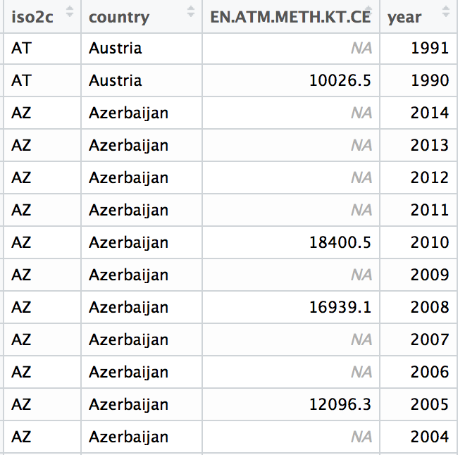
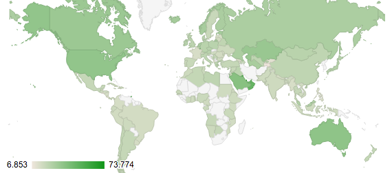

## <i class="fa fa-arrow-circle-o-up"></i> Objectives

- Getting data into R from the World Bank Development Indicators with `WDI`

- Dealing with missing data

- Correlation (statistics and plots)

- Rescaling (with functions)

- Weighting and Aggregating

## <i class="fa fa-check"></i> Pop Quiz

- What is the **difference** between R and RStudio?

- In R, what are **packages** and how do you **install** and load them?

- What are **objects** and what are **functions**? Give examples.

- What is the **assignment operator**? What is **component selection**?

## World Development Indicators

You can also load data stored **remotely** (on another computer) into R. There are many ways to do this, depending on the data source.

Today we will download data from the World Bank's [World Development Indicators](http://data.worldbank.org/indicator) using the [WDI](https://github.com/vincentarelbundock/WDI) package.

## Find WDI Indicator ID

-  **Go** the the World Bank's website: <http://data.worldbank.org/indicator>.

- **Click** on the indicator you are interested in.

- **Copy** the indicator ID. Example for *Foreign Direct Investment*:


## Download WDI

Now use the `WDI` function to download the indicator:

```{r message=FALSE, cache=TRUE}
# Load WDI package
library(WDI)

# Download data. Place in new object called fdi
fdi <- WDI(indicator = 'BX.KLT.DINV.CD.WD', start = 1990, end = 2014)

head(fdi)
```

## Some cleaning

We probably want to do some **cleaning** of this data set:

- **Rename** the indicator to something that is more intuitive.

- **Remove** units that are not countries (e.g. 'Arab World').

## Renaming variables

To rename variables in a data frame use the `rename` function from the [dplyr](https://github.com/hadley/dplyr) package.

```{r, message=FALSE}
library(dplyr)

fdi <- rename(fdi, foreign_direct_investment = BX.KLT.DINV.CD.WD)

head(fdi)
```

## Removing non-countries (1)

All countries have an [ISO 2 Letter Country Code](https://en.wikipedia.org/wiki/ISO_3166-1_alpha-2). These include 2 letters.

`iso2c` codes have patterns that we can use to select specific types of units.

- Regions (like 'Arab World') have `iso2c` codes that begin or end with a number.

- Economic groupings (Euroarea, Heavily indebted poor countries, etc) have `iso2c` letter codes beginning with X and Z (XC, XE, etc).

- Finally, we want to drop the EU (EU) and OECD (OE) in order to not double count units. . .

## Removing non-countries (3)

```{r}
# Create vector of all iso2c codes for units we don't want
regions <- unique(fdi$iso2c[grep('[0-9]', fdi$iso2c)])
regions <- c(regions, fdi$iso2c[grep('^[XZ]', fdi$iso2c)])
regions <- c(regions, 'EU', 'OE')

# Keep rows with iso2c codes that are not regions
fdi <- subset(fdi, !(iso2c %in% regions))

head(fdi)
```

## <i class="fa fa-arrow-up"></i> Advanced: Regex

If you're interested: we use [regular expressions](https://en.wikipedia.org/wiki/Regular_expression) to select character strings with certain characteristics (e.g. `[0-9]`, `[^[XZ]]`).

Note: regular expressions are very powerful, but also can take awhile to learn.

## Download multiple WDI indicators

We can download multiple indicators at once. To do this simply create a **vector of ID code strings**:

```{r, cache=TRUE}
indicators <- c('EN.ATM.METH.KT.CE', 'EG.USE.ELEC.KH.PC',
                         'EN.ATM.CO2E.PC', 'SP.POP.GROW',
                         'EG.USE.COMM.CL.ZS')

wdi <- WDI(indicator = indicators, start = 1990, end = 2014)

names(wdi)
```

## Cleaning code for reference

```{r}
library(dplyr) # contains rename and %>% functions

# Remove unwanted regions
regions <- unique(wdi$iso2c[grep('[0-9]', wdi$iso2c)])
regions <- c(regions, wdi$iso2c[grep('^[XZ]', wdi$iso2c)])
regions <- c(regions, 'EU', 'OE')

wdi <- subset(wdi, !(iso2c %in% regions))

# Rename indicators
wdi <- wdi %>% rename(methane_emissions = EN.ATM.METH.KT.CE) %>%
               rename(electricity_use = EG.USE.ELEC.KH.PC) %>%
               rename(co2_emissions = EN.ATM.CO2E.PC) %>%
               rename(population_growth = SP.POP.GROW) %>%
               rename(alternative_energy = EG.USE.COMM.CL.ZS)
```

## Missing Data

Remember that in R, missing data is usually coded `NA`. Note that sometimes data set creators also use other codes, such as `-999`.

A good first step for exploring missing data is to use the `summary` function, which gives you a count of the number of NA's. It will also help you identify if there are any `-999` codes, i.e. likely by showing unintuitive `min` and `max` values.

```{r}
summary(fdi$foreign_direct_investment)
```

## Look at the data

Always take a look at your data to get a sense of the distribution of missing values. Maybe spot why values are missing.



## Recode special values to NA

Special codes like `-999` often indicate specific reasons for missing data. You should take the time to **understand the substantive meaning** of these codes.

Ultimately, you may want to convert these into `NA` for analysis.

For example, imagine we have a data frame called `survey` and we want to recode all `-999` values of some variable called `trust` as `NA`

```{r eval=FALSE}
data$trust[data$trust == -999] <- NA
```

## Dropping observations with missing data (1)

You can drop observations with missing values on **one** variable with `subset`:

```{r, eval=FALSE}
fdi <- subset(fdi, is.na(foreign_direct_investment))
```

## Dropping observations with missing data (2)

You can drob missing data on **multiple variables** with the `DropNA` function from the [DataCombine](https://github.com/christophergandrud/DataCombine) package.

```{r}
library(DataCombine)

# Indicators to create complete cases on
indicators_environ <- c('electricity_use', 'co2_emissions',
                         'population_growth', 'alternative_energy')

wdi <- DropNA(wdi, Var = indicators_environ)
```

Use this to get **complete cases** for your composite indicator.

## Single impute missing values

Once you have analysed the reasons for your missing data, it **may** be reasonable to single impute values rather than drop cases.

For example, maybe it is reasonable to replace `NA` values with the variable `mean`:

```{r, eval=FALSE}
fdi$foreign_direct_investment[
                        is.na(fdi$foreign_direct_investment)] <-
                    mean(fdi$foreign_direct_investment, na.rm = TRUE)
```

**Note:** these decisions need to be **fully justified**.

## <i class="fa fa-exchange"></i> Correlation

One way to understand the structure of your components is to examine how they correlate with each other.

Use the `cor` function to find how two variables correlate with each other:

```{r}
cor(wdi$electricity_use, wdi$co2_emissions, use = 'complete.obs')
```

## Bi-variate plots

Another view with a bi-variate `plot`.

```{r}
plot(wdi$electricity_use, wdi$co2_emissions)
```

## Correlation matrix

You can create a correlation matrix to view multiple bi-variate correlations at once:

```{r}
# Remember we created a vector of indicator names earlier
environ_cor <- cor(wdi[, indicators_environ], use = 'complete.obs')

environ_cor
```

## Easier view

```{r}
corrplot::corrplot(environ_cor, method = 'number')
```

## <i class="fa fa-balance-scale"></i> Rescaling

As we discussed in the lecture, there are multiple ways you can rescale your component variables so that they are all on the same scale, e.g. **Min-Max**, and **Z-Scores**.

Before we learn these specific tools, let's learn a powerful new capability: creating your own functions.

## <i class="fa fa-arrow-up"></i> Creating Functions

Use the `function` function to create new functions!

E.g. we can create a function to find the sample mean
($\bar{x} = \frac{\sum x}{n}$) of a vector.

```{r}
fun_mean <- function(x){
    sum(x) / length(x)
}

## Find the mean
fun_mean(x = swiss$Examination)
```

## <i class="fa fa-arrow-up"></i> Why create functions?

Functions:

- Simplify your code if you do repeated tasks.

- Lead to fewer mistakes.

- Are easier to understand.

- Save time over the long run--a general solution to problems in different
contexts.

## <i class="fa fa-balance-scale"></i> Min-Max function

To create a function to do Min-Max rescaling remember the equation:

$$
I_{u,t} = \frac{x_{u,t} - \mathrm{min}(\mathrm{X})}{\mathrm{max}(\mathrm{X}) - \mathrm{min}(\mathrm{X})}
$$

So the R function would be:

```{r}
min_max <- function(x) {
            (x - min(x, na.rm = T))/
            (max(x, na.rm = T) - min(x, na.rm = T))
}
```

## <i class="fa fa-balance-scale"></i> Min-Max rescale

Now use the function:

```{r}
fdi$fdi_min_max <- min_max(fdi$foreign_direct_investment)

```

## <i class="fa fa-balance-scale"></i> Compare original to Min-Max

```{r include=FALSE}
library(tidyr)

fdi_min <- fdi[, c('iso2c', 'year', 'foreign_direct_investment', 'fdi_min_max')]

fdi_min <- fdi_min %>% gather(version, value, 3:4)
```

```{r echo=FALSE, message=FALSE, warning=FALSE}
library(ggplot2)

ggplot(fdi_min, aes(value, group = version)) +
    geom_histogram() +
    facet_wrap(~ version, scale = 'free') +
    xlab('') + ylab('Count\n') +
    theme_bw()
```

## <i class="fa fa-balance-scale"></i> Z-Score rescale

The equation for Z-Scores is:

$$
I_{u,t} = \frac{x_{u,t} - \mu_{\mathrm{X}}}{\sigma_{\mathrm{X}}}
$$

So, the R function would be:

```{r}
z_score <- function(x) {
                (x - mean(x, na.rm = T)) /
                sd(x, na.rm = T)
}
```

## <i class="fa fa-balance-scale"></i> Z-Score rescale

Now use the function:

```{r}
fdi$fdi_z_score <- z_score(fdi$foreign_direct_investment)
```

## <i class="fa fa-balance-scale"></i> Compare original to Z-Score

```{r include=FALSE}
fdi_z <- fdi[, c('iso2c', 'year', 'foreign_direct_investment', 'fdi_z_score')]

fdi_z <- fdi_z %>% gather(version, value, 3:4)
```

```{r echo=FALSE, message=FALSE, warning=FALSE}
ggplot(fdi_z, aes(value, group = version)) +
    geom_histogram() +
    facet_wrap(~ version, scale = 'free') +
    xlab('') + ylab('Count\n') +
    theme_bw()
```

## <i class="fa fa-undo"></i> Reverse a variable's direction

The equation to reverse a variable's direction:

$$
I_{u,t} = \mathrm{max}(\mathrm{X}) - x_{u,t}
$$

So the function would be:

```{r}
reverse_direction <- function(x) max(x, na.rm = T) - x
```

Now use the function:

```{r}
fdi$fdi_z_reverse <- reverse_direction(fdi$fdi_z_score)
```

## <i class="fa fa-undo"></i> Reverse

```{r include=FALSE}
fdi_rev <- fdi[, c('iso2c', 'year', 'fdi_z_score', 'fdi_z_reverse')]

fdi_rev <- fdi_rev %>% gather(version, value, 3:4)
```

```{r echo=FALSE, message=FALSE, warning=FALSE}
ggplot(fdi_rev, aes(value, group = version)) +
    geom_histogram() +
    facet_wrap(~ version, scale = 'free') +
    xlab('') + ylab('Count\n') +
    theme_bw()
```

## <i class="fa fa-plus"></i> Weight/Aggregate

Once we have our rescaled components, we then decide how to weight and aggregate our indicators.

For this course you will use '**expert-judgement**'.

## <i class="fa fa-plus"></i> Weight/Aggregate example

```{r include=FALSE}
# Drop incomplete cases
# Rember we created a vector of indicator names earlier
wdi_sub <- DropNA(wdi, indicators_environ)

# Z-Score rescale
for (i in indicators_environ) {
    wdi_sub[, i] <- z_score(wdi_sub[, i])
}

# Reverse the alternative energy use scale
wdi_sub$alternative_energy <- reverse_direction(wdi_sub$alternative_energy)
```

Imagine we have four variables that we want to combine into an Environmental Unsustainability index: `electricity_use`, `co2_emissions`, `population_growth`, and `alternative_energy`.

We have use z-scores to rescale them and reversed the direction of `alternative_energy`. 

The results are in a data frame called `wdi_sub`.

## <i class="fa fa-plus"></i> Weight/Aggregate example

We think that `co2_emissions` is particularly important so we give it a weighting of 0.3, the others have a weighting of 0.1:

```{r}
wdi_sub$unsustainability <- wdi_sub$co2_emissions * 0.3 +
                                  wdi_sub$electricity_use * 0.1 +
                                  wdi_sub$population_growth * 0.1 +
                                  wdi_sub$alternative_energy * 0.1
```

## Component indicator results

```{r}
hist(wdi_sub$unsustainability, main = '',
     xlab = 'Raw Unsustainability Index')
```

## Rescale the index

We could of course rescale the index so that it is between 0 and 100.

```{r}
wdi_sub$unsustainability <- min_max(wdi_sub$unsustainability) * 100
```

## Rescaled index

```{r}
hist(wdi_sub$unsustainability, main = '',
     xlab = 'Rescaled Unsustainability Index')
```

## <i class="fa fa-map-o"></i> Map the index

You could also map the results (good sanity check):

```{r, message=FALSE}
# Subset data for only 2011
wdi_2011 <- subset(wdi_sub, year == 2011)

# Use the googleVis package to create the map
library(googleVis)

map <- gvisGeoChart(wdi_2011, locationvar = "country",
                    colorvar = "unsustainability")
```

## <i class="fa fa-map-o"></i> Map the index

```{r eval=FALSE}
plot(map)
```



## Experiment 

It is important to **try and compare** multiple weighting schemes to examine how sensitive the index is to each one.


## <i class="fa fa-arrow-circle-o-up"></i> Seminar: Make an Index

Using World Bank Development Indicators create an Educational Achievement Index.

- Select and download at least 4 indicators

- Examine and deal with missing values

- Explore the variables with a correlation matrix

- Put the variables on the same scale and reverse variable directions as need be.

- Weight and aggregate the variables into an composite index.

- Display the results (histogram and map)
